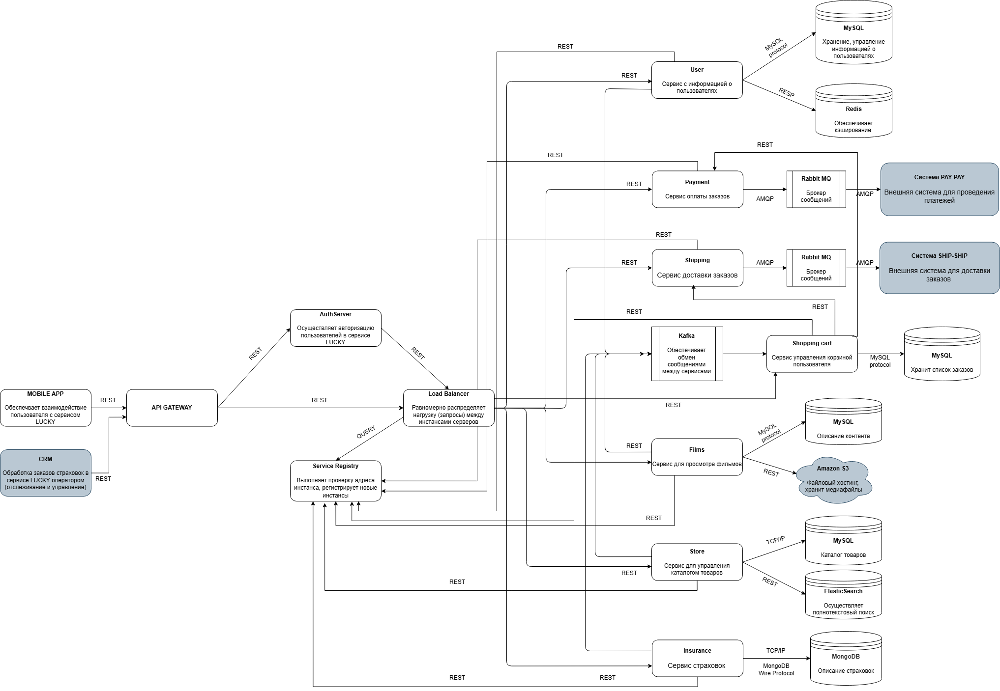

# Проектирование API: страхование питомцев

## Описание проекта
LUCKY - мобильное приложение для владельцев домашних животных, которое объединяет интернет-магазин зоотоваров, стриминг контента про животных и дополнительные услуги. В связи с расширением бизнеса заказчик хотел добавить новую функциональность - оформление страховки для домашнего животного. Репозиторий охватывает полный цикл работы системного аналитика: анализ требований, проектирование архитектуры, моделирование и документирование API.

## Цель
Спроектировать и задокументировать API нового микросервиса страхования домашних животных в приложении LUCKY - с учётом существующей архитектуры и возможности расширения функциональности в будущем.

## Функции

- Просмотр каталога страховых продуктов для домашних животных
- Фильтрация страховок по виду питомца (кошка, собака; список будет расширяться)
- Добавление страховки в общую корзину приложения
- Поддержка русскоязычной и англоязычной версий приложения

## Задачи

- Выявила и структурировала требования к новой функциональности: функциональные требования, ограничения MVP, нефункциональные требования (таймаут, нагрузка, локализация)
- Доработала диаграмму контейнеров C4 с учётом нового микросервиса Insurance
- Смоделировала профиль API: определила Job Story, действия пользователей, границы API и операции
- Задокументировала API в формате OpenAPI 3.0 (Swagger)

## Артефакты
- Диаграмма контейнеров C4

- Документ с профилем API - (Job Story, действия пользователей, границы API, описание операций)

- Документация API - Спецификация OpenAPI 3.0 (YAML)

## Результаты

Архитектура:
Принято решение выделить отдельный микросервис Insurance вместо добавления страховок в существующий каталог товаров чтобы обеспечить независимость развития функциональности.
База данных: MongoDB - гибкая схема под разные виды страховых продуктов
Интеграция с корзиной: через Apache Kafka, по аналогии с остальными сервисами
Доступ: через существующую цепочку API Gateway → Service Registry → Load Balancer

Профиль API
В рамках моделирования профиля API определила Job Story, описала действия пользователя и разграничила зоны ответственности между сервисами: новый "Insurance API" отвечает за каталог страховок, существующие "Shopping Cart API" и "Payment API" - за добавление в корзину и оплату.

Документация API
Разработана спецификация для эндпоинта GET /v1/insurance:
- Фильтрация по виду питомца (petType)
- Поддержка локализации (Accept-Language)
- Полное описание схем запроса и ответа
- Обработка ошибок: 400, 404, 500, 502
- Аутентификация: Bearer Token (JWT)

### Инструменты
- Draw.io - диаграмма контейнеров C4
- Swagger Editor - документирование API (OpenAPI 3.0)
- Google Docs - документ с профилем API

